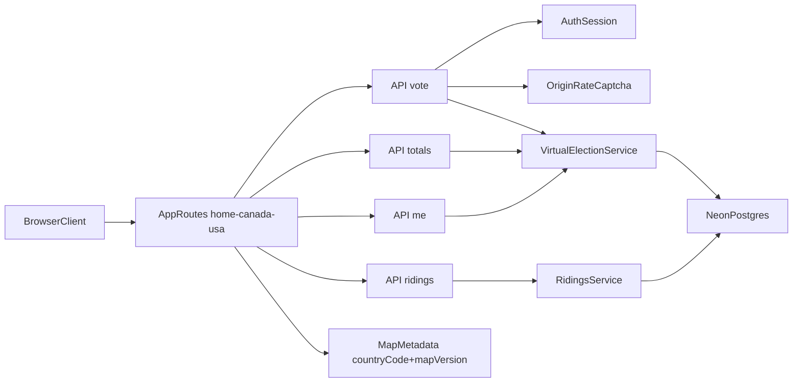
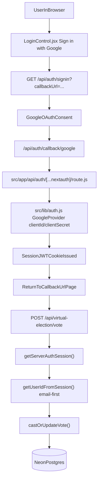

# Virtual Election (Standalone Next.js Platform)

Standalone extraction of Poliwave Virtual Election into React + JavaScript + Next.js.

## What is included

- Authenticated one-vote-per-user virtual election flow
- API routes: `vote`, `totals`, `me`, `ridings`
- Atomic PostgreSQL aggregate updates (pre-aggregated country result tables)
- Regional breakdown charts and 15s refresh polling
- Security checks: origin check, rate limit, optional CAPTCHA

## Tech stack

- Next.js (App Router, JavaScript)
- Auth.js / NextAuth (Google OAuth)
- Drizzle ORM + Neon Postgres
- Recharts for regional visualizations

## Quick start

1. Install dependencies:

```bash
npm install
```

2. Copy environment template:

```bash
copy env.example .env.local
```

3. Fill `.env.local` with your Neon and Google OAuth values.

4. Run migrations:

```bash
npm run db:migrate
```

5. Start dev server:

```bash
npm run dev
```

Open `http://localhost:3000/`.

---

## Neon database initialization (new account)

### 1) Create Neon project

- Create a new Neon project and database from dashboard.
- Copy the pooled connection string.

### 2) Configure `.env.local`

Required:

- `DATABASE_URL`
- `AUTH_SECRET`
- `AUTH_URL`
- `AUTH_GOOGLE_ID`
- `AUTH_GOOGLE_SECRET`

Optional hardening:

- `VIRTUAL_ELECTION_ALLOWED_ORIGINS`
- `RECAPTCHA_SECRET_KEY`
- `VIRTUAL_ELECTION_RATE_WINDOW_MS`
- `VIRTUAL_ELECTION_RATE_MAX`
- `VIRTUAL_ELECTION_BURST_WARN_THRESHOLD`
- `VIRTUAL_ELECTION_DEADLINE_ISO`
- `ALLOW_SCOPE_FALLBACK` (set `true` only in local dev/test if riding-scope base tables are unavailable)

### 3) Run schema migration

```bash
npm run db:migrate
```

### 3.1) Seed election-scoped options (recommended)

```bash
npm run db:seed:options
```

This seeds:

- `elections` (active scope metadata)
- `parties` (authoritative party IDs)
- `election_parties` (allowed parties for the election scope)

This creates:

- `virtual_election_votes`
- `RidingResults.canada_riding_result`
- `RidingResults.usa_riding_result`
- `elections`
- `parties`
- `election_parties`

### 4) Verify tables

Run in Neon SQL editor:

```sql
select * from virtual_election_votes limit 5;
select * from "RidingResults".canada_riding_result limit 5;
select * from "RidingResults".usa_riding_result limit 5;
```

### 5) (Optional) clear virtual election data

```sql
truncate table virtual_election_votes restart identity;
truncate table "RidingResults".canada_riding_result;
truncate table "RidingResults".usa_riding_result;
```

---

## Architecture



## Google OAuth workflow

This project uses Auth.js/NextAuth with Google as the provider.  
The sign-in button is rendered on the client, while session validation is enforced in server routes before vote operations.



### File-level mapping

1. Client sign-in link: `src/lib/components/virtualElection/LoginControl.jsx`
2. Auth route handler: `src/app/api/auth/[...nextauth]/route.js`
3. Google provider config: `src/lib/auth.js`
4. Session enforcement in vote API: `src/app/api/virtual-election/vote/route.js`
5. User identity normalization: `src/lib/server/virtualElection/identity.js`

## Data model

- `virtual_election_votes`: canonical user vote row (`user_id + scope` unique)
- `RidingResults.canada_riding_result`: pre-aggregated counters for Canada ridings by party/scope
- `RidingResults.usa_riding_result`: pre-aggregated counters for USA districts/states by party/scope
- USA district IDs use canonical keys: `us-fed-2025-<STATEFP>-<DISTRICT_OR_AL>`
- USA presidential state IDs use canonical keys: `US-PRES-2025-<FIPS>`

Vote API performs a single atomic SQL operation:

1. read previous vote
2. upsert current vote
3. decrement previous aggregate if changed
4. increment new aggregate

---

## Project map

- `src/app/page.js`: intro homepage
- `src/app/canada/page.js`: Canada election page bootstrap
- `src/app/usa/page.js`: USA default route redirect to presidential page
- `src/app/usa/houseOfRepresentatives/page.js`: USA house page bootstrap
- `src/app/usa/president/page.js`: USA presidential page bootstrap
- `src/lib/components/virtualElection/VirtualElectionPage.jsx`: client orchestrator
- `src/lib/components/virtualElection/Header.jsx`: shared country selector header
- `src/lib/components/virtualElection/LoginControl.jsx`: auth-aware vote controls
- `src/lib/components/virtualElection/MapComponent/VirtualElectionMap.jsx`: map surface
- `src/lib/components/virtualElection/MapComponent/adapters/usa.js`: USA house + president map adapter (`USA.json` + `us-atlas`)
- `src/lib/components/virtualElection/regionBreakdown/RegionSeatChart.jsx`: seat chart
- `src/lib/components/virtualElection/regionBreakdown/RegionVoteChart.jsx`: vote chart
- `src/lib/components/virtualElection/regionBreakdown/profiles/*`: country-aware region logic
- `src/app/api/virtual-election/*`: API handlers
- `src/lib/server/virtualElection/service.js`: domain logic + atomic SQL
- `src/lib/server/virtualElection/loadElectionPageData.js`: shared page bootstrap loader
- `src/lib/server/virtualElection/abuse.js`: abuse protections

---

## Agent handoff notes

### Current state

- Core backend contracts and data model are ported.
- UI parity includes controls, totals, overwrite confirmation, regional filtering, and polling.
- `VirtualElectionMap.jsx` currently ships with a list-based selector as the extraction-safe default.

### Priority next tasks for agents

1. Replace list selector with full MapLibre/PMTiles riding map adapter.
2. Port exact tooltip behavior and locked-hover rendering from previous Svelte map.
3. Add test suite:
   - vote lifecycle (`created`, `updated`, `unchanged`)
   - concurrent/conflict behavior
   - auth + origin + rate limit errors
   - regional alias coverage (`NL`, `NB`, `YT`)
4. Promote in-memory rate limiter to shared store (Redis/Upstash) for multi-instance production.

### API contracts

- `POST /api/virtual-election/vote`
- `GET /api/virtual-election/totals`
- `GET /api/virtual-election/me`
- `GET /api/virtual-election/ridings`
- `GET /api/virtual-election/options`


POST /api/virtual-election/vote
Casts or updates the authenticated user’s vote for one riding/party in the selected scope (country, district, year). Enforces auth, scope/party/riding validation, abuse checks, and returns updated me vote state.
GET /api/virtual-election/totals
Returns current aggregated virtual-election totals by riding for the selected scope. Each riding includes per-party totals, leader, intensity, and total votes.
GET /api/virtual-election/me
Returns the current authenticated user’s vote state for the selected scope (voted: false if not signed in or no vote exists).
GET /api/virtual-election/ridings
Returns the list of ridings available in the selected scope (code, name, subnational) for map/selector rendering.
GET /api/virtual-election/options
Returns authoritative election bootstrap options for the selected scope (`scopeId`, `countryCode`, `mapVersion`, `districtIdNamespace`, `allowedParties`, `ridings`, and UI rules). Clients should use this to render allowed UI choices; server remains the source of truth for enforcement.
For presidential scope, options also include `mode`, `regionKey`, `allocationRule`, and `electoralVotesVersion`.
Current routes:

- `/` intro page
- `/canada` Canada federal virtual election
- `/usa` USA election selector
- `/usa/houseOfRepresentatives` USA House virtual election (`us/fed/2025`)
- `/usa/president` USA presidential virtual election (`us/pres/2025`)

Note: USA map currently uses direct AK/HI placement (insets can be added later).
Error semantics are aligned with prior implementation:

- `401` unauthenticated
- `400` invalid input/scope/party/riding
- `403` forbidden origin
- `409` vote window closed or conflict
- `429` rate limited
- `503` virtual election tables missing

---

## Deploy notes (Vercel + Neon)

- Set all env vars in Vercel project settings.
- Add production domain to `VIRTUAL_ELECTION_ALLOWED_ORIGINS`.
- Add production callback URL for Google OAuth.
- Run `npm run db:migrate` against production Neon DB before first launch.
